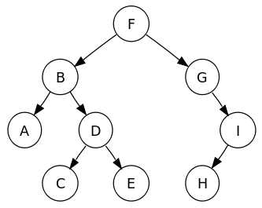

# 29. - Abstraktní datové typy
>Abstraktní datové typy, seznam, fronta, zásobník, halda, strom, asociativní pole.

**Abstraktní datové typy (ADT)**

- matematický model nezávislý na konkrétní implementaci
- popisuje chování (možné operace) z hlediska uživatele dat
- není závislý na implementaci v konkrétním programovacím jazyce
- často se u nich uvádí časová či paměťová složitost (důležité z hlediska efektivního návrhu algoritmu)
- uživatel používá pouze obecné rozhraní ADT a konkrétní implementace mu zůstává skryta
- ADT může mít více různých implementací, např. seznam lze implementovat jako pole nebo jako spojový seznam
- jazyky mají ve svých standartních knihovnách obvykle obsaženy optimalizované implementace ADT

**Datové struktury**

- narozdíl od ADT se jedná o konkrétní reprezentaci dat
- definuje je ten, kdo je implementuje

*Datový typ* určuje rozsah hodnot a definované operace pro proměnou daného typu.

## Vlastnosti
Nejdůležitější vlastnosti abstraktního typu dat jsou:

- **Všeobecnost implementace:** Jednou navržený ADT může být zabudován a bez problémů používán v jakémkoli programu.
- **Zapouzdření:** Rozhraní by mělo být pojato jako uzavřená část. Uživatel by měl přesně vědět, co ADT dělá, ale ne jak to dělá.
- **Integrita:** Uživatel nemůže zasahovat do vnitřní struktury ADT. Tím se výrazně sníží riziko nechtěného smazání nebo změna již uložených dat.
- **Modularita:** „Stavebnicový“ princip programování je přehledný a umožňuje snadnou výměnu části kódu. Při hledání chyb mohou být jednotlivé moduly považovány za kompaktní celky. Při zlepšování ADT není nutné zasahovat do celého programu.

Pokud je ADT programován objektově, jsou většinou tyto vlastnosti splněny.

## Operace

- **konstruktor** zodpovídá za správnou inicializaci a sestavené platné reprezentace datového typu na základě dodaných parametrů
- **selektor** slouží k výběru dat
- **modifikátor** slouží ke změně dat

## Příklady
Mezi základní abstraktní datové typy patří:

- **zásobník** (stack)
- **fronta** (queue)
- **seznam** (list)
- **množina** (set)
- **strom** (tree) - speciálním typem stromu je **halda** (heap)
- **zobrazení** (map) - také známé jako **asociativní pole**

### Seznam

- kontejner pro ukládání dat předem neznámé délky
- typicky implementované pomocí dynamického pole nebo spojových seznamů
- mohou se v něm opakovat stejné prvky (narozdíl od množiny)
- typické operace (nemusí byt implementované všechny)
  - vytvoření prázdného seznamu
  - test, zda je seznam prázdný
  - přidání na začátek seznamu
  - přidání na konec seznamu
  - získání prvního prvku (head)
  - získání všech prvků kromě prvního (tail)

*Jednosměrný spojový seznam*

*Obousměrný spojový seznam*

*Kruhový spojový seznam*

### Fronta

- prvek, který byl nejdříve přidán, bude také nejdříve odebrán
- anglické označení First In First Out (FIFO)
- implementace pomocí spojových seznamů (výhodný je obousměrný) nebo pole
- využití:
  - plánování procesů v OS (FCFS)
  - meziprocesová komunikace - roura (pipe)
  - síťová komunikace - buffer pro datové pakety (switch, bridge, router)

*Fronta*

Typické operace:

- **enqueue**: vložení hodnoty na konec fronty,
- **dequeue**: odstranění hodnoty ze začátku fronty,
- **front**: čtení hodnoty na začátku fronty a
- **empty**: testování, zda je fronta prázdná.

### Zásobník

- prvek, který byl naposled přidán bude nejdříve odebrán
- anglické označení Last In First Out (LIFO)
- implementace pomocí pole nebo spojových seznamů

*Zásobník*

Typické operace:

- **push**: vložení hodnoty na vrchol zásobníku,
- **pop**: odstranění hodnoty z vrcholu zásobníku,
- **top**: čtení hodnoty z vrcholu zásobníku a
- ***empty**: testování, zda je zásobník prázdný.

### Strom

- hierarchická struktura
- každý uzel může mít několik synů (přímých potomků)
- všechny uzly kromě kořenového uzlu mají právě jednoho otce
- uzel, který nemá žádné potomky (je koncový) se nazývá *list*
- každý podstrom je tké strom
- použití:
  - halda
  - vyhledávací strom

*Strom*

Vlastnosti:

- **N-arita** - Kolik smí mít každý uzel maximálně potomků, z tohoto hlediska patří mezi neoblíbenější binární stromy (každý uzel má 0, 1 nebo 2 potomky).
- **Hloubka uzlu** - Hloubka uzlu je délka cesty od kořene k uzlu
- **Výška stromu** - Je rovna hodnotě maximální délky stromu.
- **Šířka stromu** - Počet uzlů na stejné úrovni.
- **Vyváženost** - Strom je vyvážený, jestliže má uzly rovnoměrně rozložené tak, že má nejmenší možnou výšku.

Procházení stromem:

1. Průchod do šířky

  Projdou se nejprve všechny uzly stromu v jedné hloubce a až poté se pokračuje do další hladiny, kde se opět projdou všechny uzly v dané hloubce.

2. Průchod do hloubky

  Procházení začíná v kořeni stromu a postupuje se po potomcích uzlu. Procházení končí, když už v žádné větvi není nenavšívený potomek.

  - *Preorder*
    - proveď akci
    - projdi levý podstrom
    - projdi pravý podstrom
  - *Inorder*
    - projdi levý podstrom
    - proveď akci
    - projdi pravý podstrom
  - *Postorder*
    - projdi levý podstrom
    - projdi pravý podstrom
    - proveď akci

#### Příklad průchodu stromem

- Preorder (NLR): F, B, A, D, C, E, G, I, H
- Inorder (LNR): A, B, C, D, E, F, G, H, I
- Postorder (LRN): A, C, E, D, B, H, I, G, F
- Procházení do šířky (po vrstvách) Level-order: F, B, G, A, D, I, C, E, H

### Halda

- datová struktura splňující vlastnost haldy, tj. pokud  je potomek , tak
  -  pro *max heap* nebo
  -  pro *min heap*
- často se používá pro implementaci prioritní fronty
- efektivita operací haldy je klíčová pro mnoho algoritmů
- Vlastnost tvaru – strom je buď perfektně vyvážený binární strom, nebo pokud je poslední úroveň stromu nekompletní, uzly plní strom zleva doprava

*Binární minimální halda*

Operace s haldou:

- INSERT - přidání nového prvku do haldy
- DELETE MAX nebo DELETE MIN - vyjmutí kořenu v max heap nebo v min heap
- DELETE(v) - smaže uzel „v“
- MIN, MAX - vrátí minimální resp. maximální klíč v haldě
- DECREASE KEY(v, okolik) - zmenšení klíče uzlu „v“ o hodnotu „okolik“
- INCRESE KEY(v, okolik) - zvětšení klíče uzlu „v“ o hodnotu „okolik“
- MERGE - spojení dvou hald do jedné nové validní haldy obsahující všechny prvky obou původních
- MAKE - dostane pole N prvku a vytvoří z nich haldu

Složitost operací:

- Stavba haldy - 
- Získání hodnoty kořene - 
- Vložení/odstranění/nalezení prvku - 
- Sloučení hald - 

### Asociativní pole

- prvkům z množiny klíčů přiřazuje nejvýše jednu hodnotu
- různá označení
  - mapa (Java, C++)
  - slovník (.NET, Python)
  - asociativní pole (Javascript, PHP)
- v porovnání s obecným polem může být klíčem i nečíselný typ; datový typ klíče musí pouze implementovat operaci porovnání
- z klíče nelze přímo spočítat umístění prvku v poli - používá se *hashovací funkce*

